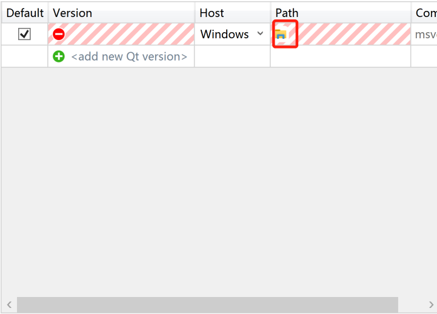
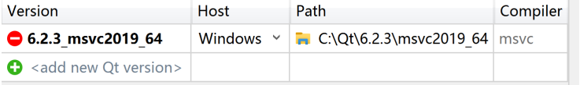
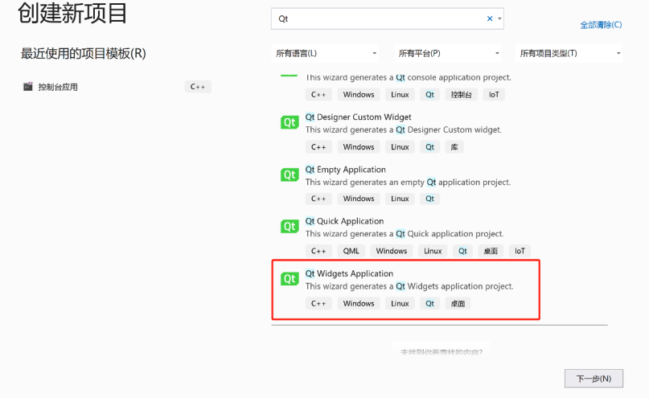
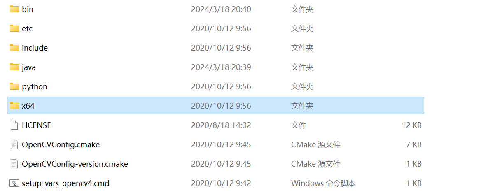

# NKUcpp-pyhsics-experiments-images-programming-based-on-opencv
## NKU-Experimenter 你的物理实验报告拯救者，现已加入物理实验拯救计划全家桶[doge]
## 本仓库为南开大学C++2024大作业代码仓库
## 声明：本项目100%独立自主完成，创意100%原创，没有任何参考项目和模仿项目！！！看在独立创意和解决大物实验报告问题的份上，给一颗star吧，送人star，手有余香，求求啦
---
## 注意
众所周知，在使用第三方库的情况下，没有配置环境是不能直接运行源代码的，如果想运行源代码的话，需要配置第三方库。另外一种简单的直接使用桌面程序的方法就是利用vs2022的release功能，配置好相应的dll文件，就可以直接使用，本人尝试realease了文件，但是目前测试还未成功，如果感兴趣，可以点击右侧的release下载测试，如果能成功运行那就太棒啦！
如果你想build from source code，那么请你仔细阅读该文档最后的环境配置教程，本项目使用了QT、opencv库和Tesseract库，其中tesseract库的配置十分困难，国内的blog提到的方法均以失效，只能按照官方文档中的配置方法进行配置。

---


---
## Motivation
在完成物理实验报告时，往往需要加入物理实验原理图，通常有两个办法：

1、使用word图形插入绘制

2、拍照或扫描物理实验书上的实验原理图并粘贴到实验报告文件中。

然而，这两种方法都面临问题。

第一种方法十分麻烦，word绘图调整绘图元素之间的位置十分不便，而且，有些物理元素不适宜使用word绘制。

第二种方法同样面临着问题，一方面是直接拍照容易造成原理图扭曲，并且因为物理教材背景色不是白色，直接粘贴会显得十分突兀。另一方面，即使使用扫描功能，也无法避免图片扭曲的问题，使用手机自带的文档抓取功能并不能很好地识别原理图（往往会把文字部分包含进来）。并且，使用扫描功能会丢失原理图色彩信息。

因此，我开发了本项目希望实现物理实验图像的识别、切割、处理、导出集一体的一站式操作。
## 实现功能
1、对输入的图片进行处理，实现自动矫正、扭转

2、自动提取图片中的物理原理图信息，并将其切割下来

3、对物理原理图中的关键元素进行加强

4、将物理原理图的背景换成白色或透明并导出。
## 工具（语言）需求
1、C++

2、OpenCv库

3、TesseractOCR库 用于文字检测和定位

4、Qt Tool

## 实现思路
1、利用opencv库对图片进行处理，变化为HSV图像。

2、进行边缘检测

3、提取关键（感兴趣）区域，用长方形框选

4、处理框选出的图像，生成旋转矩阵（角度）

6、擦除文字

7、更换背景

8、输出图像

9、图形化界面开发


## to do list
- [ √] 设计类的结构
- [ √ ] 实现边缘检测
- [  √] 实现图片提取
- [  √] 设计图形化界面（可选）

## How to build
### 下载QT（已经下载并配置vs可以跳过）
https://www.qt.io/cs/c/?cta_guid=074ddad0-fdef-4e53-8aa8-5e8a876d6ab4&signature=AAH58kH0egoaNdhWUkb3CrMH5KBkxAFAfg&utm_referrer=https%3A%2F%2Fwww.qt.io%2Fdownload&portal_id=149513&pageId=12602948080&placement_guid=99d9dd4f-5681-48d2-b096-470725510d34&click=f34c55ec-9f2b-4b50-976e-f0f8c1bfb6b5&redirect_url=APefjpGBiX0UKTIp6IKtiCZ_FHyffB4SznUymVuFkbA7PJudjDP-LiROcddjXL6Z3cuRp8XZgXFoq1NutMCf1VURrhBJn-YU4hV6ePQgE2wFsyY2KeST8hBnUN-lRDcNZLw3w7T2y9G_5Uibtr25F8P-NQXQbV1hQ6xtbfVTgRn5yaBqx6BYIX8KbIvskrCYGUBLY1LnTcvgiibot5YJuEYf_W3PlZBgHCIKZfNmMYtbFvgLKmHHliE8BjNT7oUH-GOgillhZB2NQRbL3v4viOYWd5F6NcUtAQ&hsutk=197f600d7cf052bbf3ee41923cc41e7f&canon=https%3A%2F%2Fwww.qt.io%2Fdownload-open-source 

下载opensourceuser版QT tool

按照提示开始安装桌面版QT和QT design tool

正常安装后，点击maintenance QT或uninstall QT，选择add or removw components安装对应QT版本的msvc



之后，打开VS，选择扩展菜单下Qt VS Tools->Qt Versions。点击绿色加号，添加关联版本。定位到QT安装目录下的msvc文件夹



安装后，可测试是否正确安装。
在 vs 中选择新建->项目，在搜索模板中搜索“Qt”，在出现的模板中选择新建“Qt Widget
Application”



设置自己的项目名称，点击下一步并根据提示选择默认选项即可，至创建完成。点击运行，有窗口跳出，则安装成功。

OpenCV的下载和配置
https://opencv.org/releases/
点击链接，下载windows版opencv源代码

将bin配置到系统环境变量当中。
之后，你需要在vs中的库文件、头文件、dll中分别添加opencv的路径。

#include<opencv2/opencv.hpp>
#include<iostream>
using namespace cv;

int main(int argc, char** argv) {
	// 加载图像到Mat对象src中
	Mat src = imread("C:\\Users\\Administrator\\Pictures\\300x300.jpg");

	// 检查图像是否成功加载，如果src.empty()返回true，则表示加载失败
	if (src.empty()) {
		printf("could not load image...\n");
		// 加载失败时返回-1，终止程序运行
		return -1;
	}
	// 创建一个名为"test opencv setup"的窗口，并设置其大小可以调整（WINDOW_NORMAL）
	namedWindow("test opencv setup", WINDOW_NORMAL);

	// 在名为"test opencv setup"的窗口中显示图像src
	imshow("test opencv setup", src);

	// 等待用户按键，参数为0表示无限等待
	waitKey(0);
	return 0;
}

运行上方代码，运行成功则为opencv配置成功

vcpkg安装
请参照[官方文档](https://github.com/microsoft/vcpkg/blob/master/README_zh_CN.md)下载并安装vcpkg
配置环境变量 C:\src\vcpkg\vcpkg(定位到你的vcpkg的安装路径)

安装Tesseract的c++的lib和include
Run `vcpkg install tesseract:x64-windows` for 64-bit. Use –head for the master branch.
添加环境变量 C:\Program Files\Tesseract-OCR（定位到你的Tesseract依赖的安装路径）

下载Tesseract[程序](https://github.com/UB-Mannheim/tesseract/wiki)及语言包


配置环境变量
D:\Tesseract\tessdata（定位到你的tessdata的文件夹）

```C++
//测试程序
#include <iostream>
#include <opencv2/opencv.hpp>
#include <tesseract/baseapi.h>
 
int main() {
    // 读取图像
    cv::Mat image = cv::imread("test.png");
 
    // 初始化Tesseract OCR引擎
    tesseract::TessBaseAPI ocr;
    ocr.Init(NULL, "eng", tesseract::OEM_DEFAULT);//切换成你想要识别的语言
    ocr.SetPageSegMode(tesseract::PSM_AUTO);
 
    // 转换图像为灰度
    cv::cvtColor(image, image, cv::COLOR_BGR2GRAY);
 
    // 设置图像数据
    ocr.SetImage(image.data, image.cols, image.rows, 1, image.cols);
 
    // 进行OCR识别
    std::string result = ocr.GetUTF8Text();
 
    // 输出识别结果
    std::cout << "识别结果: " << result << std::endl;
 
    // 释放资源
    ocr.End();
 
    return 0;
}